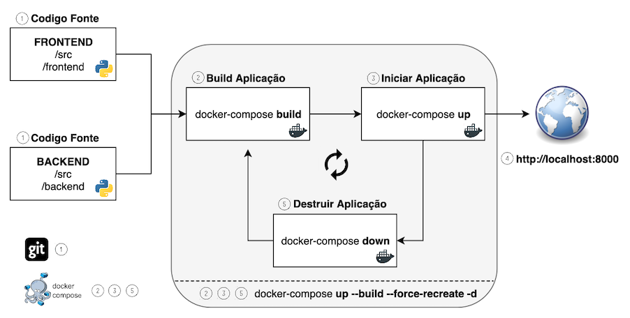

# Deploy Beats
[](https://travis-ci.com/weesntos/deploybeats)

# Como usar

## Pre-requisito

* Instalar o **Git** para download do `codigo fonte`. [Clique aqui](https://git-scm.com/downloads)
* Instalar o **Docker** para hospedar os `containers`. [Windows](https://docs.docker.com/docker-for-windows/install/) | [MacOS](https://docs.docker.com/docker-for-mac/install/) | [Linux](https://docs.docker.com/install/linux/docker-ce/ubuntu/)
* Instalar o **Docker-Compose** para `build` e `init` das aplicacoes. [Clique aqui](https://docs.docker.com/compose/install/)




## 1 - Download do codigo fonte

```
git clone https://github.com/weesntos/deploybeats.git
```

## 2 - Build

### Stack - Frontend + Backend
```
docker-compose build
```

### Frontend Only
```
docker-compose build frontend
```

### Backend Only
```
docker-compose build backend
```

## 3 - Init

### Stack - Frontend + Backend
```
docker-compose up -d
docker-compose logs -f
```

### Frontend Only
```
docker-compose up -d --no-deps frontend
docker-compose logs -f
```

### Backend Only
```
docker-compose up -d backend
docker-compose logs -f
```

## 4 - Abrir e Testar Aplicacao
WEB: http://localhost:8000

API: http://localhost:8001

```
docker-compose run tests
```


## 5 - Destroy
```
docker-compose down
```

## All In One: Build + Destroy + Init
```
docker-compose up --build --force-recreate -d
docker-compose logs -f
```
